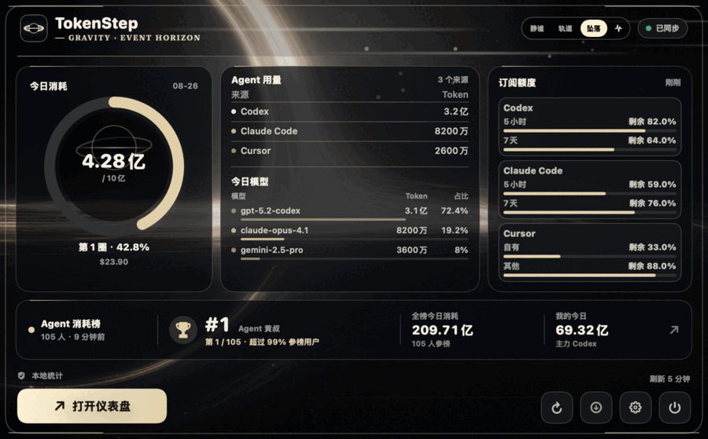
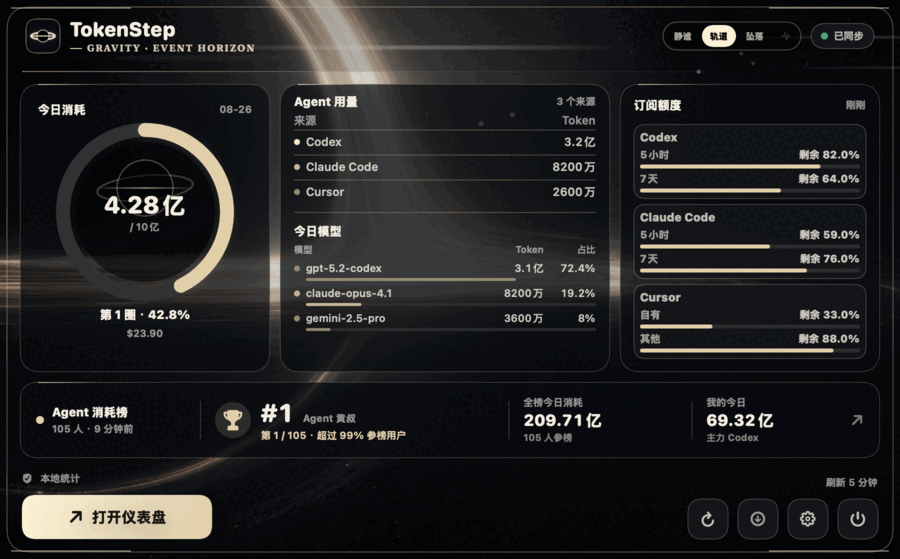
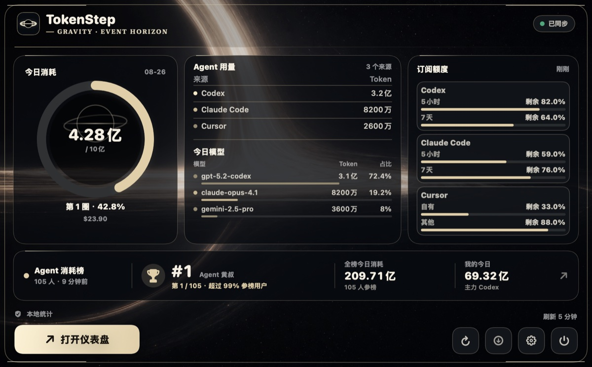
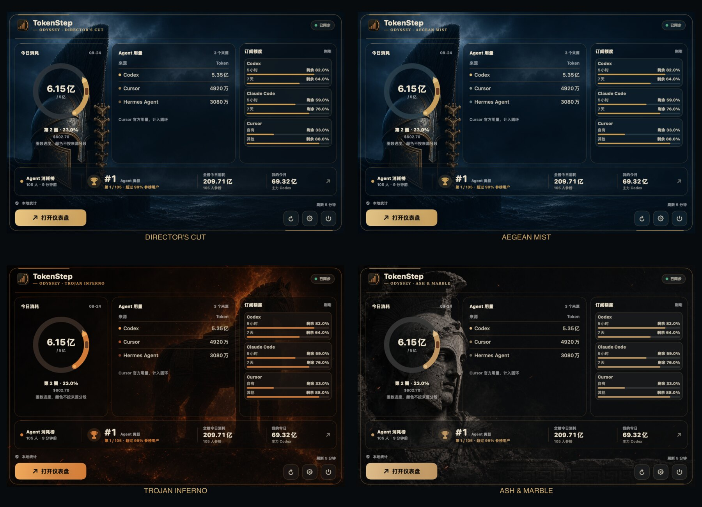

# TokenStep

**像记录步数一样，记录你每天的 AI Token 消耗。**

AI 时代，每个人都在和 Agent 一起工作。

但我们很少知道：今天到底用了多少 AI？有没有比昨天更进一步？

TokenStep 是一个 macOS 菜单栏 App，用来本地统计你在 Codex、Claude Code 等 AI 编程工具里的 Token 消耗，并把它变成一个像 Apple 健身圆环一样的每日目标。

默认目标是：**每天 1 亿 Token**。

当你超过目标，圆环会进入下一圈。用得越多，颜色越深。

它不是为了严肃比较，而是让你直观看到：今天你和 AI 一起走了多远。


## 立即下载

下载最新版 DMG，打开后把 `TokenStep.app` 拖进「应用程序」即可使用：

[下载 TokenStep 最新版](https://github.com/Backtthefuture/TokenStep/releases/latest/download/TokenStep-0.2.9.dmg)

也可以从 Release 页面查看所有版本：

[GitHub Releases](https://github.com/Backtthefuture/TokenStep/releases/latest)

TokenStep 已使用 Developer ID 签名并通过 Apple 公证。首次打开时，macOS 可能会出现标准确认弹窗，这是正常现象。

Windows版本由十七做了移植，欢迎大家前往使用：https://github.com/canyexuanfan/TokenStep-Windows/releases 

## 0.2.9 重大更新：引力动效实验室

0.2.9 给「引力边界」主题装上了真正的引力动效。黑洞不再是一张静态壁纸：打开浮层或仪表盘的瞬间，你就在朝它坠落。

<p align="center">
  
</p>

- **三档签名动效，浮层右上角随时切换**：静谧（只剩环境光呼吸）、轨道（白热等离子光斑拖着彗尾沿吸积盘弧线绕行，星尘坠落）、坠落（黑洞以自身为中心原地膨胀、越来越亮，9 秒内把你吞进去后悬置）。
- **Token 坠落脉冲**：坠落模式下，今日 Token 增长或点击浮层波形按钮，会从视界方向涌出一圈进食波。
- **每次打开都是一次新的坠落**：浮层关闭即复位，重新打开从头开始逼近；窗口失焦、被遮挡时动效自动暂停省电。
- **低成本有底线**：最高 24 fps；低电量模式降到 12 fps 并冻结逼近；截图和 macOS「减少动态效果」下保持完全静态；所有动效由纯函数采样驱动，可用固定时间离线渲染逐帧校验。
- **可感但克制**：静谧档保持接近静态的呼吸；轨道档持续有可察觉的流动；只有坠落档全力逼近。

<p align="center">
  
</p>

本次不改变 Token、金额、额度、排行榜及本地采集口径，经典与奥德赛主题不受影响。完整说明见 [0.2.9 发布说明](docs/RELEASE_NOTES_0.2.9.md)。

## 0.2.8 更新：引力边界图标精修

0.2.8 精修了「设置 → 通用 → 主题皮肤包」中的引力边界预览图标：黑洞、吸积盘和上下引力透镜弧重新居中并收进图标安全区，同时增加圆角裁切，修复图形穿出卡片边界的问题。

本次只调整主题选择图标，不改变首页、浮层和其他界面的黑洞主视觉，也不改变 Token、金额、额度、排行榜及本地采集口径。完整说明见 [0.2.8 发布说明](docs/RELEASE_NOTES_0.2.8.md)。

## 0.2.7 重大更新：引力边界黑洞主题包

0.2.7 新增第三套完整皮肤包「引力边界」。它不是给首页换一张壁纸，而是把近距事件视界、象牙白吸积盘和低速引力光流接进 TokenStep 的整套界面。

<p align="center">
  
</p>

- **第三套主题皮肤包**：在 `设置 → 通用 → 主题皮肤包` 中，可在经典、奥德赛和引力边界之间随时切换。
- **黑洞是第一视觉层**：巨大事件视界占据左上，象牙白吸积盘横贯界面，并保留上方透镜弧和更暗的下方反转弧。
- **全界面统一换肤**：菜单栏浮层、今日、历史、隐私、设置、更新窗口、Token Island 和两类分享卡全部覆盖。
- **低成本动态光流**：吸积盘有缓慢相位漂移和轻微呼吸；窗口失焦、截图和 macOS“减少动态效果”状态会自动暂停，最高 24 fps。
- **原创应用内标记**：主题启用时，TokenStep 的应用内 Logo 会切换为事件视界与吸积盘标记。
- **更新检查更稳**：GitHub API 被限流时自动使用非 API 的最新 Release 通道；手动检查增加 10 秒防连点，并在双通道都失败时显示可理解的限流恢复时间。

主题使用原创生成背景和通用黑洞科学结构，不包含电影 Logo、演员、剧照、飞船或第三方水印。完整说明见 [0.2.7 发布说明](docs/RELEASE_NOTES_0.2.7.md) 与 [引力边界主题实现说明](docs/INTERSTELLAR_THEME_PACK_0.2.7.md)。

## 0.2.6 重大更新：检查更新后立即进入安装闭环

0.2.6 修复了从浮层主动检查更新时“查到了，但没有继续弹出更新窗口”的断点，并把下载、验证、替换与自动重启做成可追踪的完整链路。

- **发现新版立即弹窗**：点击浮层或主窗口的更新按钮后，若检测到新版，会立刻打开独立更新窗口。
- **更新窗口确保可见**：菜单栏瞬时浮层自动收起，更新窗口切到当前桌面并保持在前台，不再被浮层遮住。
- **一次点击完成升级**：点击“安装并重启”后自动下载 DMG、校验签名、公证与版本，备份旧 App、替换 `/Applications/TokenStep.app` 并重新打开。
- **全过程可诊断**：检查、弹窗、安装启动和失败都会写入生命周期日志；新增隔离安装验证脚本，避免把“能下载”等同于“能升级”。
- **不改变自动检查策略**：后台检查仍采用非打扰提醒；只有用户主动点击检查并发现新版时才强制弹出窗口。

本次不改变 Token、金额、额度、排行榜及本地采集口径。完整说明见 [0.2.6 发布说明](docs/RELEASE_NOTES_0.2.6.md)。

## 0.2.5 重大更新：动态特洛伊火焰、模型用量与更新提醒

0.2.5 让奥德赛主题从静态电影画面进入动态状态，同时把菜单栏浮层和更新体验补得更完整。

- **特洛伊火焰动起来了**：特洛伊火海篇章会在浮层可见时呈现火焰明暗、烟雾、火星和余烬；关闭浮层后立即暂停，截图仍保持稳定静态画面。
- **浮层增加今日模型用量**：在 Agent 来源下方展示今日模型；模型较多时自动整理为 Top 3 +「其他」，不改变统计口径。
- **更新入口覆盖整个 App**：菜单栏浮层、主窗口和设置共用同一套检查状态；启动、定时和回到前台时可自动检查新版。
- **更新提醒更明确**：发现新版后，菜单栏出现标记，浮层和主窗口显示更新卡；仍由用户确认后安装，不做静默强制更新。
- **修复检查动画不停止**：检查完成后立即显示结果，不再残留一直旋转的图标。

经典主题、其他奥德赛篇章、Token/金额/额度/排行榜口径及本地优先原则保持不变。完整说明见 [0.2.5 发布说明](docs/RELEASE_NOTES_0.2.5.md)。

## 0.2.4 重大更新：奥德赛主题包

TokenStep 第一次从“更换配色”升级为完整的**主题皮肤包系统**。你可以继续使用熟悉的经典界面，也可以切换到更有电影质感的奥德赛主题；数据、统计口径与本地优先原则保持不变。

<p align="center">
  
</p>

### 两套皮肤包，随时切换

- **经典**：保留青绿、海蓝、紫藤、琥珀和石墨五种原版配色。
- **奥德赛**：新增导演剪辑、爱琴海冷雾、特洛伊火海和灰烬神像四个视觉篇章。
- TokenStep 会分别记住你上次使用的经典配色和奥德赛篇章，来回切换不用重新设置。

| 视觉篇章 | 核心元素 |
| --- | --- |
| 导演剪辑 | 根据不同界面自动组合冷雾头盔、特洛伊木马与灰烬神像 |
| 爱琴海冷雾 | 深海、冷雾、青铜头盔与竖向骨节冠 |
| 特洛伊火海 | 焦黑木马、火焰背光、烟尘与余烬 |
| 灰烬神像 | 破损大理石战士、裂纹、玄武岩与希腊回纹 |

### 不只是换一张背景图

- 菜单栏浮层重构为“今日用量 / Agent 用量 / 订阅额度”三段式电影构图。
- Agent 消耗榜收为底部横向信息带，不再形成第五列或把浮层横向撑宽。
- Today、历史、隐私、设置、更新窗口、分享卡与 Token Island 全面换肤。
- 新增奥德赛弓箭阶梯 Logo；用量采用骨金、冷金或余烬橙，绿色只保留给同步成功等状态反馈。
- 关闭排行榜后浮层会自动收短，多来源额度则使用紧凑布局完整展示。

打开 `设置 → 通用 → 主题皮肤包` 即可切换。完整说明见 [0.2.4 发布说明](docs/RELEASE_NOTES_0.2.4.md)，或直接[下载已签名并通过 Apple 公证的最新版](https://github.com/Backtthefuture/TokenStep/releases/latest/download/TokenStep-0.2.9.dmg)。

## TokenStep 适合谁？

TokenStep 适合这些人：

- 每天使用 Codex / Claude Code 写代码的人
- 用 AI Agent 做内容、开发、研究、自动化的人
- 想知道自己每天到底消耗了多少 AI Token 的人
- 把 AI 当成生产力基础设施，而不是偶尔试用工具的人

以前我们看步数，知道自己今天有没有动起来。

现在我们看 Token 消耗，知道自己今天有没有真正用 AI 推进工作。

## 它能做什么？

- 菜单栏实时显示今日 Token 消耗和进度圆环。
- 点击菜单栏打开轻量浮层。
- 原生 macOS 仪表盘：今日、历史、统计、模型与工具、隐私。
- 超过 1 亿后自动进入第 2 圈、第 3 圈。
- 最近 30 天 Token 使用趋势。
- 按客户端、按模型查看用量统计。
- 粗略估算 Token 消耗金额。
- 每日目标可设置，默认每天一个亿。
- 打开面板时按设置的新鲜度刷新；后台在接电时最低 15 分钟、电池或低电量模式下最低 30 分钟刷新，并跳过未变化的数据。
- 开机启动，可在设置里关闭。
- 主题皮肤包：可随时切换经典、奥德赛和引力边界；引力边界覆盖全界面并带低成本黑洞光流动效。
- 一键截图分享当前页面。
- 一键生成「昨日 AI 节奏」分享卡，展示 24 小时使用波形、峰值时段和节奏标签。
- Codex / Claude Code 剩余额度可在设置中打开，默认关闭。
- 自动检查更新，发现新版后可下载已签名公证的 DMG。
- 本地数据存放在 `~/Library/Application Support/TokenStep`。

## 当前支持

- Codex：读取本地 JSONL 用量元数据并维护逐会话增量缓存；缓存异常时自动重建，必要时回退 Codex 本地 SQLite 汇总。
- Claude Code：读取 `~/.claude/projects/**/*.jsonl` 里的 usage 元数据。
- CC Switch：实验支持，读取本机 `proxy_request_logs` 中成功且 token 数大于 0 的请求行。
- 额度显示：Codex 读取本机 Codex 账户限额；Claude Code 会在本机读取 Claude Code 钥匙串凭证，并请求 Anthropic usage 接口获取 5 小时 / 7 天剩余额度。

更多 AI 编程工具支持会逐步加入。

支持策略和候选 Agent 说明见 [docs/AGENT_SUPPORT.md](docs/AGENT_SUPPORT.md)。

## 隐私

TokenStep 默认只做本地统计。

它只读取 Token 用量元数据，例如日期、模型、客户端名称和 Token 数量，用于生成趋势、圆环和统计图。

它不会上传你的代码、prompt、对话正文或项目文件。

「消耗金额」只是本地粗略估算，不等于真实账单。

完整说明见 [docs/PRIVACY.md](docs/PRIVACY.md)。

## 安装方式

1. 下载 [TokenStep 最新版 DMG](https://github.com/Backtthefuture/TokenStep/releases/latest/download/TokenStep-0.2.9.dmg)。
2. 打开 DMG。
3. 把 `TokenStep.app` 拖到「应用程序」。
4. 启动 TokenStep。
5. 在 macOS 右上角菜单栏点击 TokenStep 图标。

更详细的安装说明见 [docs/INSTALL.md](docs/INSTALL.md)。

## 为什么做 TokenStep？

因为 AI 编程工具正在变成新的「工作现场」。

过去我们用日历看时间，用步数看运动，用记账软件看消费。

但 AI 使用量一直是隐形的。

TokenStep 想把这件事变得可见：

**今天你不是用了多少工具，而是和 AI 一起走了多少步。**

## 下载统计

查看 GitHub Release 下载数：

```bash
python3 script/github_download_stats.py
```

统计方案见 [docs/ANALYTICS.md](docs/ANALYTICS.md)。

## 本地构建

要求：

- macOS 14+
- Xcode Command Line Tools

构建并运行：

```bash
./script/build_and_run.sh --verify
```

只构建不启动：

```bash
./script/build_swiftui_and_run.sh --no-launch
```

生成的 App 位于：

```text
TokenStepSwift/dist/TokenStep.app
```

## 发布打包

Developer ID 签名：

```bash
TOKENSTEP_VERSION=0.2.9 \
CODE_SIGN_IDENTITY="Developer ID Application: Your Name (TEAMID)" \
./script/package_release.sh
```

签名 + Apple 公证：

```bash
TOKENSTEP_VERSION=0.2.9 \
CODE_SIGN_IDENTITY="Developer ID Application: Your Name (TEAMID)" \
TOKENSTEP_NOTARY_PROFILE="tokenstep-notary" \
./script/package_release.sh --notarize
```

产物会生成到：

```text
release/TokenStep-<version>.zip
release/TokenStep-<version>.dmg
```

维护者说明见 [docs/RELEASE.md](docs/RELEASE.md)。

0.2.9 发布说明见 [docs/RELEASE_NOTES_0.2.9.md](docs/RELEASE_NOTES_0.2.9.md)；0.2.8 发布说明见 [docs/RELEASE_NOTES_0.2.8.md](docs/RELEASE_NOTES_0.2.8.md)；0.2.7 发布说明见 [docs/RELEASE_NOTES_0.2.7.md](docs/RELEASE_NOTES_0.2.7.md)；引力边界实现说明见 [docs/INTERSTELLAR_THEME_PACK_0.2.7.md](docs/INTERSTELLAR_THEME_PACK_0.2.7.md)；0.2.6 更新闭环说明见 [docs/RELEASE_NOTES_0.2.6.md](docs/RELEASE_NOTES_0.2.6.md)；0.2.4 奥德赛主题包说明见 [docs/ODYSSEY_THEME_PACK_0.2.4.md](docs/ODYSSEY_THEME_PACK_0.2.4.md)。

## 开源协议

MIT。见 [LICENSE](LICENSE)。
